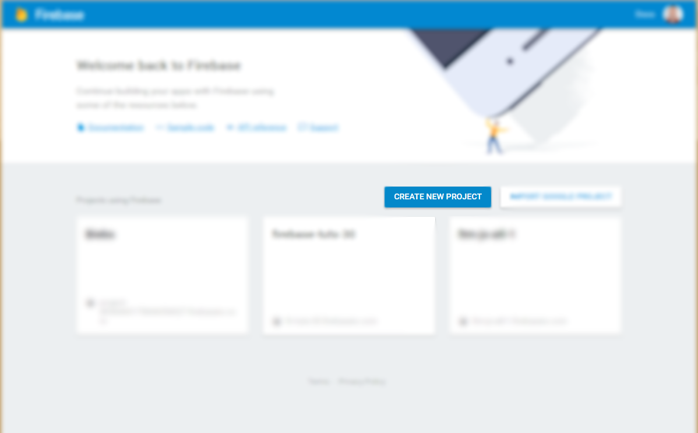
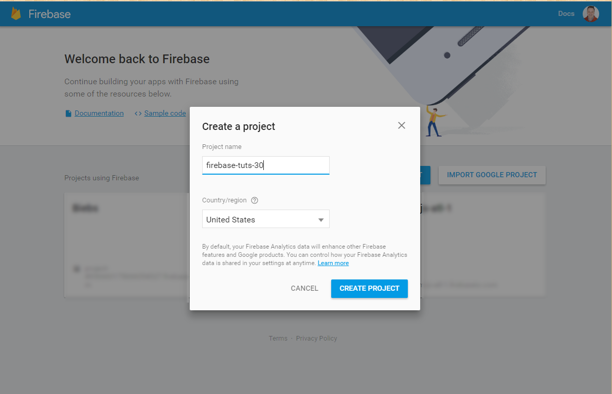
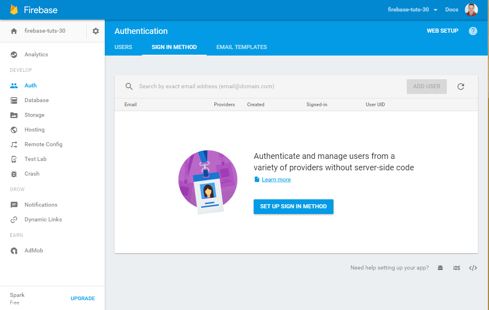
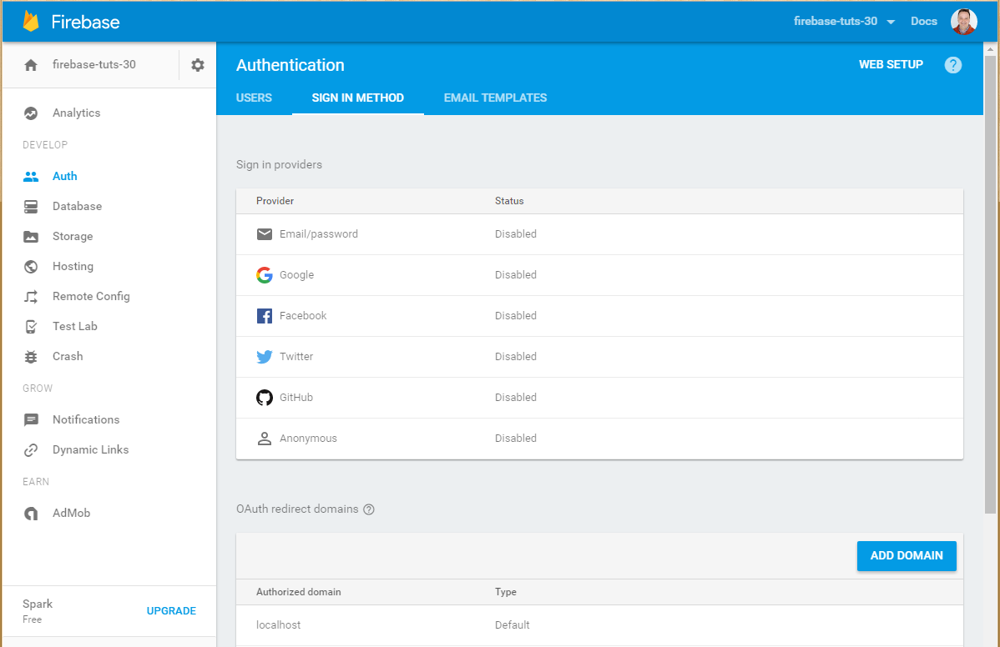
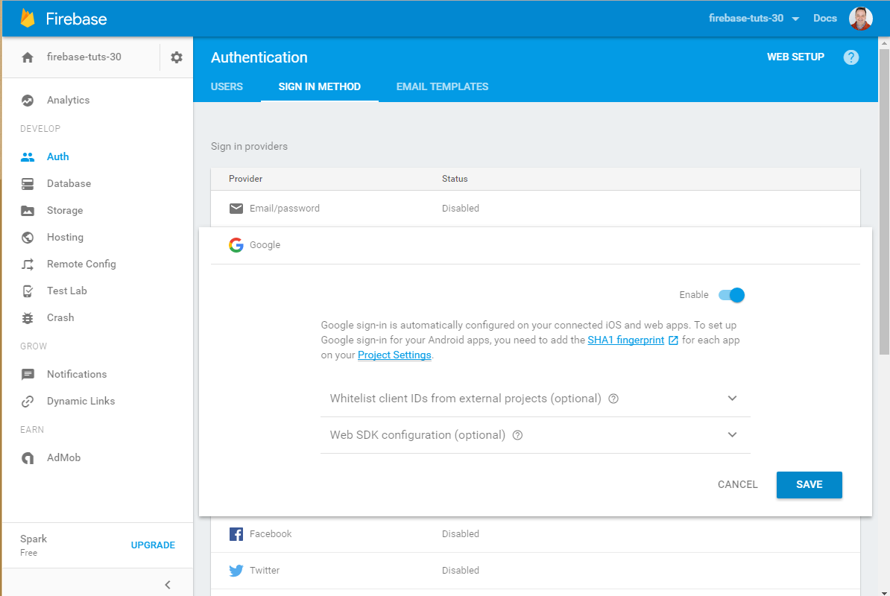

# Firebase Tutorial 3.0
Firebase Tutorial Code for Version 3.0

* Create a new repo in GitHub
* Clone repository on your local machine
* Add .gitignore
 * /node_modules/\*\*/\*
 * /dist/\*\*/\*
 * *.log
* Create src directory
* Create src/less
* Create src/scripts
* Create index.html
* Create main.less (under src/less)
* Create app.js (under src/scripts)
* run npm init
* npm install --save-dev gulp gulp-less gulp-connect gulp-open
* create gulpfile.js
* git add .
* git commit -m "Initial Commit for Build"

# Firebase Setup

* Create New Project on Firebase



* Add config and initializeApp in app.js


```javascript
// Initialize Firebase
var config = {
    apiKey: "",
    authDomain: "",
    databaseURL: "",
    storageBucket: "",
};
firebase.initializeApp(config);
```

* Add script link in index.html
```html
<script src="https://www.gstatic.com/firebasejs/live/3.0/firebase.js"></script>
```

* From Terminal:
 * firebase login
 * firebase init
 * firebase deploy

# Adding Google Auth

* Login to firebase console
* Click on Auth on the left
* Click on Sign-in Method

* Click on Google

* Click on enable, and save


Yes, it's that easy, it creates all the keys you need on the [https://console.developers.google.com](https://console.developers.google.com)

#Firebase Database Essentials

A note on this, the default rules for the database will require authentication, please see the authentcation section below to enable authentication.
You can also turn off authentication being required in your database rules, but I would NOT suggest that.

##Write to your Firebase Database
```javascript
//Get A reference to your Database
var myCollection = firebase.database().ref('MyCollection');

//Push an object to your collection
myCollection.push({ name: 'alex'});
```


##To Read from a collection

There are a couple ways to read from a collection.

1) To setup an event to listen to value changes on a collection value (be as specific as possible, listening to root is not good)
```javascript
    var myCollection = firebase.database().ref('MyCollection');
    myCollection.on('value', function (results) {
    var colectionData = results.val();
    // iterate through results coming from database call; messages
    for (var item in collectionData) {
        //NOTE: item is actually the key, so use that for data-id in your html
        $list = $('<li></li>')
        $list.attr('data-id',item);
        //You'll probably want to put something from your item like:
        $list.append('<div></div>').html(item.name);
        $('#results').append($list);
    });
```

2) To get a snapshot value, you would want to do this: 
```javascript
    var myCollection = firebase.database().ref('MyCollection');
    var userData = myCollection.once('value').then(function (snapshot) {
        if (snapshot.val()) {
            FirstName = snapshot.val().name;
        }
    });
```

##To Update a collection
```javascript
//The id is the key of the item in the collection
var myCollection = database.ref('/MyCollection/' + id);

// update name property
myCollection.update({
    name: 'julio'
})
```

##To Delete from a collection
```javascript
//The id is the key of the item in the collection
var myCollection = database.ref('/MyCollection/' + id);

// update name property
myCollection.remove();
```

#Authentication Essentials 

##General References
```javascript
var provider = new firebase.auth.GoogleAuthProvider();
var auth = firebase.auth();
```

##Login

```javascript
auth.signInWithPopup(provider).then(function (result) {
        // This gives you a Google Access Token. You can use it to access the Google API.
        //I would save this token and user in localStorage so you can check it in the future
        var token = result.credential.accessToken;
        // The signed-in user info.
        var user = result.user;
        console.log(user.displayName);
    }).catch(function (error) {
        console.log(error);
})
```

##Logout
```javascript
auth.signOut().then(function () {
    console.log('logged out');
}, function (error) {
    // An error happened.
    console.log(error);
});
```
##Check if logged in
```javascript
//I would check a localStorage token if exists first, but here is there AuthStateChange function
auth.onAuthStateChanged(function (user) {
    if (user) {
        // User is signed in.
        // Save current user variable, state, I use a user object
        currentUser = user;
        return true;
    } else {
        // No user is signed in.
        return false;
    }
});
